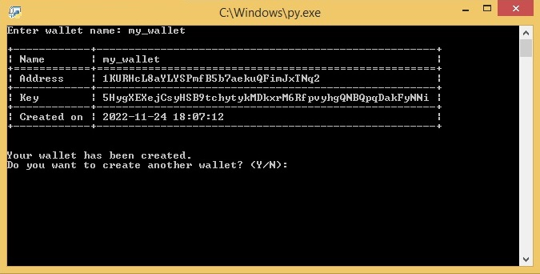
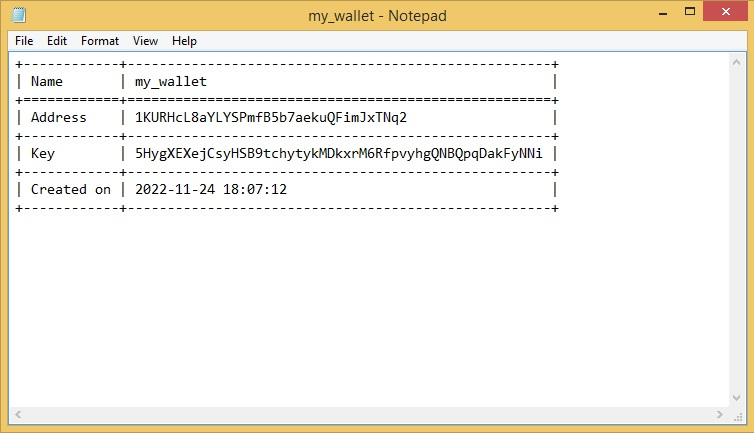
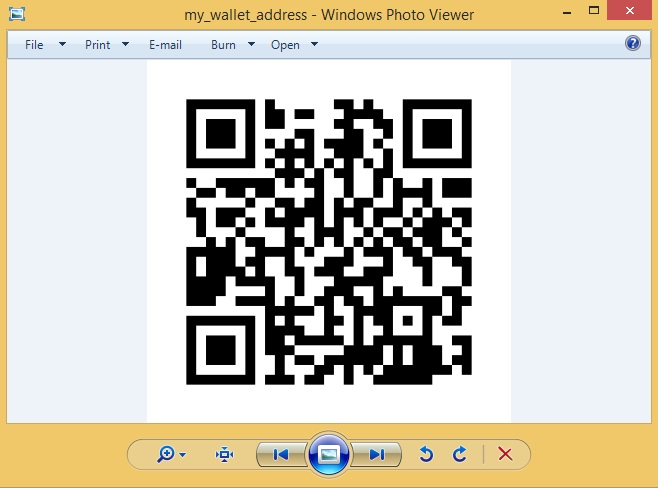

# Bitcoin Wallet Generator

CLI tool to generate Bitcoin wallets.



## Getting Started

### Dependencies

To be able to use the program, you should install all the dependencies:

```
pip install -r requirements.txt
```

### Installing

To download this program, enter the following command in your terminal:

```
git clone https://github.com/erichoangnle/btc_wallet_generator.git
```

### Usage

Enter new wallet name and press Enter. You wallet details will be saved to a text file:



And your wallet public key and private key QRCode will be saved as PNG file for your convenience:



## Contact

Email: erichoangnle@gmail.com

Facebook: https://www.facebook.com/eric.le.520900

Project link: https://github.com/erichoangnle/btc_wallet_generator.git
